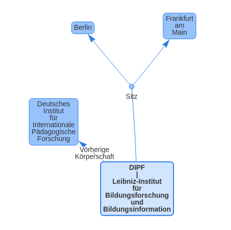
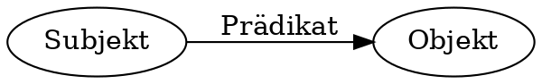
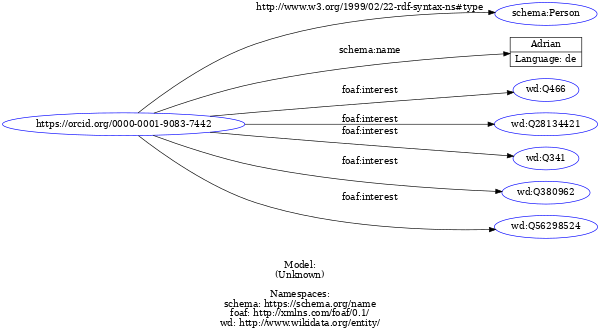
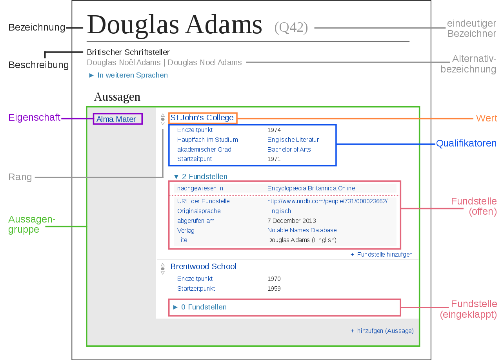

<style type="text/css">
    .reveal table th { font-size: .65em}
    .reveal table td { font-size: .65em}
    .container {
        background-size: cover;
        overflow-y: hidden;
    }
    .footer {
        display: none;
    }
</style>

# Linked Open Data – Eine Einführung

  <small>
          <a href="http://lobid.org/team/ap#!">Adrian Pohl</a> <br />
    Offene Infrastruktur, Hochschulbibliothekszentrum NRW (hbz) </small> <br />
    <a href="https://www.hbz-nrw.de"></a><br/>
  </small>
  <small>DIPF, 2022-05-06</small>

  <small>
    <a href="https://slides.lobid.org/2022-05-06-lod-dipf/">https://slides.lobid.org/2022-05-06-lod-dipf/</a>
    <br/>
    <a rel="license" href="http://creativecommons.org/licenses/by/4.0/"></a>
  </small>

---

### Agenda

1. Warum Linked Open Data?
2. LOD-Definition
3. 

---

# 1. Warum Linked Open Data?


---

### Warum Linked Open Data (LOD)?

* Überführung traditioneller bibl. Praktiken in das Web
* Sichtbarkeit und Auffindbarkeit im Web erreichen
* Nachnutzbarkeit ermöglichen
* Synergieeffekte durch Verlinkung mit anderen Daten
* Verbesserung der Recherchemöglichkeiten
<small>Pohl, Adrian / Ostrowski, Felix (2010): 'Linked Data' - und warum wir uns im hbz-Verbund damit beschäftigen." B.I.T. Online 13(3): S. 259-268. [Preprint (PDF)](https://hbz.opus.hbz-nrw.de/files/269/PDFA_Linked_Data_Pohl_Ostrowski_2010.pdf)</small>

---

### LOD als politische Entscheidung

<p align="left">RDF hat zum Ziel, Austausch und Nachnutzung von Daten über Systemgrenzen hinweg zu vereinfachen. Somit richtet es sich an Organisationen,</p>
1. deren Geschäftsmodell nicht darauf basiert, Nutzer\*innendaten zu horten
2. die nicht im kommerziellen Wettbewerb stehen
3. die existieren, um Information zu teilen

<small>Siehe auch: <a href="https://www.youtube.com/watch?v=7VGJCLef3wM">Dorian Taylor. "Linked Data is a political agenda"</a></small>

---

# 2. LOD-Definition

---

### Technische und rechtliche Offenheit

Damit Daten nachgenutzt werden können, sollten sie sowohl rechtlich als auch technisch offen sein.

---

### Open Definition

> Wissen ist offen, wenn jedeR darauf frei zugreifen, es nutzen, verändern und teilen kann – eingeschränkt höchstens durch Maßnahmen, die Ursprung und Offenheit des Wissens bewahren. 

[https://opendefinition.org/od/2.1/de/](https://opendefinition.org/od/2.1/de/)

---

### Rechtliche Offenheit

Vergabe einer [Offenen Lizenz](https://opendefinition.org/licenses/)

(für Daten hat sich [CC0](https://creativecommons.org/publicdomain/zero/1.0/) etabliert)

---

## Technische Offenheit

---

<a href="https://5stardata.info"></a>

---

### Linked Data: Best Practices

1. Nutze URIs als Namen für Dinge
2. Nutze HTTP-URIs, so dass Menschen sie aufrufen können
3. Wenn jemand einen URI aufruft, biete nützliche Informationen an unter Nutzung der Standards (RDF, SPARQL)
4. Nimm Links zu anderen URIs auf, so dass weitere Dinge entdeckt werden können.

[Tim Berners-Lee (2006ff): Linked Data – Design Issues](https://www.w3.org/DesignIssues/LinkedData.html)

---

### Exkurs: URIs

* *Uniform*: einheitliche Struktur ([RFC 3986](https://datatracker.ietf.org/doc/html/rfc3986))
* *Resource*: ein Ding, ob digital oder nicht-digital
* *Identifier*: Identifikation durch Vergabe eines Namens/einer ID

---

### URIs

- Namensräume machen URIs eindeutig
- z.B. gibt es viele Webseiten, die "about" oder "faq" heißen und durch die Angabe der Domain disambiguiert werden
- URIs können als bloßer Identifikator genutzt werden, ohne im Browser aufgerufen werden zu können

---

### RDF – Resource Description Framework

* graph-basiertes Datenmodell
* zum Austausch von Daten über das Web, entworfen und gepflegt vom W3C
* Abstraktes Modell mit verschiedenen Serialisierungsformaten (RDF/XML, Turtle, JSON-LD…)

---

### Was ist ein Graph?

[](https://lobid.org/gnd/117117618X#rels)

---


<small>[File:SocialNetworkAnalysis.png](https://commons.wikimedia.org/wiki/File:SocialNetworkAnalysis.png) von Martin Grandjean, [CC-BY-SA 4.0](https://creativecommons.org/licenses/by-sa/4.0/deed.de)</small>

---

### RDF: ein gerichteter, beschrifteter Graph

- directed labeled graph
- d.h. die Kanten haben eine Richtung und ein Etikett



---

### Tripel: Das Graph-Atom

Alle Daten in RDF existieren in Form von Tripeln mit Subjekt, Prädikat, Objekt:


---


### Abbildung von Daten in RDF
* **Subjekt**: Ressource über die eine Aussage getroffen wird
* **Prädikat**: Beziehung zwischen Subjekt und Objekt
* **Objekt**: Ressource, zu dem die Ressource in einer Verbindung steht oder ein Literal

---

### URIs und Literale

* **Subjekt** und **Prädikat** sind immer ein URI
* **Objekt** ist ein URI *oder* ein Literal (String, Date, Integer)

---

| Subjekt | Prädikat | Objekt |
|---|---|---|
| Ich | heiße | Adrian. |
| `<https://orcid.org/0000-0001-9083-7442>` | `<https://schema.org/name>` | `"Adrian"@de` . |
| Ich | interessiere mich  für | Linked Library Data. |
| `<https://orcid.org/0000-0001-9083-7442>` | `<http://xmlns.com/foaf/0.1/interest>` | `<http://www.wikidata.org/entity/Q28134421>` . |

---

### Die verschiedenen RDF-Serialisierungen sind semantisch äquivalent.

Deshalb wird es ein "abstraktes" Modell genannt.

---

### N-Triples
```
<https://orcid.org/0000-0001-9083-7442> <http://www.w3.org/1999/02/22-rdf-syntax-ns#type> <https://schema.org/namePerson> .
<https://orcid.org/0000-0001-9083-7442> <https://schema.org/namename> "Adrian"@de .
<https://orcid.org/0000-0001-9083-7442> <http://xmlns.com/foaf/0.1/interest> <http://www.wikidata.org/entity/Q466> .
<https://orcid.org/0000-0001-9083-7442> <http://xmlns.com/foaf/0.1/interest> <http://www.wikidata.org/entity/Q28134421> .
<https://orcid.org/0000-0001-9083-7442> <http://xmlns.com/foaf/0.1/interest> <http://www.wikidata.org/entity/Q341> .
<https://orcid.org/0000-0001-9083-7442> <http://xmlns.com/foaf/0.1/interest> <http://www.wikidata.org/entity/Q380962> .
<https://orcid.org/0000-0001-9083-7442> <http://xmlns.com/foaf/0.1/interest> <http://www.wikidata.org/entity/Q56298524> .
```

---

### Turtle
``` turtle
@prefix schema: <https://schema.org/name> .
@prefix foaf: <http://xmlns.com/foaf/0.1/> .
@prefix wd: <http://www.wikidata.org/entity/> .
<https://orcid.org/0000-0001-9083-7442> a schema:Person ;
  schema:name "Adrian"@de ;
  foaf:interest wd:Q466, wd:Q28134421, wd:Q341, wd:Q380962 , wd:Q56298524 .
```

---

### RDF/XML
``` xml
<?xml version="1.0" encoding="utf-8"?>
<rdf:RDF xmlns:foaf="http://xmlns.com/foaf/0.1/"
    xmlns:rdf="http://www.w3.org/1999/02/22-rdf-syntax-ns#"
    xmlns:schema="https://schema.org/name">
  <schema:Person rdf:about="https://orcid.org/0000-0001-9083-7442">
    <foaf:interest rdf:resource="http://www.wikidata.org/entity/Q28134421"/>
    <foaf:interest rdf:resource="http://www.wikidata.org/entity/Q341"/>
    <foaf:interest rdf:resource="http://www.wikidata.org/entity/Q380962"/>
    <foaf:interest rdf:resource="http://www.wikidata.org/entity/Q466"/>
    <foaf:interest rdf:resource="http://www.wikidata.org/entity/Q56298524"/>
    <schema:name xml:lang="de">Adrian</schema:name>
  </schema:Person>
</rdf:RDF>
```

---

### RDFa – RDF in attributes
``` html
<div xmlns:schema="https://schema.org/" xmlns:foaf="http://xmlns.com/foaf/0.1/"
    about="https://orcid.org/0000-0001-9083-7442" typeOf="schema:Person">
    <span property="schema:name">Adrian Pohl</span> is interested in
    <span rel="foaf:interest" resource="http://www.wikidata.org/entity/Q466">the World Wide Web</span>, <span
        rel="foaf:interest" resource="http://www.wikidata.org/entity/Q28134421">Library Linked Data</span>, <span
        rel="foaf:interest" resource="http://www.wikidata.org/entity/Q341">free software</span>, <span
        rel="foaf:interest" resource="http://www.wikidata.org/entity/Q380962">cooperation</span> and <span
        rel="foaf:interest" resource="http://www.wikidata.org/entity/Q56298524">teaching in Higher Education</span>.
</div>
```

---

### JSON-LD
``` json
{
   "@context":{
      "Person":"https://schema.org/Person",
      "name":"https://schema.org/name",
      "interest":"http://xmlns.com/foaf/0.1/interest"
   },
   "@id":"https://orcid.org/0000-0001-9083-7442",
   "@type":"Person",
   "name":"Adrian",
   "interest":[
      "http://www.wikidata.org/entity/Q466",
      "http://www.wikidata.org/entity/Q28134421",
      "http://www.wikidata.org/entity/Q341",
      "http://www.wikidata.org/entity/Q380962",
      "http://www.wikidata.org/entity/Q56298524"
   ]
}
```

---

### RDF-Visualisierung



---

### Übung: Turtle schreiben

Erstellen Sie eine kurze Beschreibung von sich orientiert am Beispiel von [Slide 25](#25).

Zur Erstellung und Validierung lässt sich gut dieser Turtle-Web-Editor nutzen: https://felixlohmeier.github.io/turtle-web-editor/

---

### RDFS und OWL

- RDF Schema und Web Ontology Language
- Beschreibugnssprachen zur Definition und Dokumentation von Properties und Klassen und deren Beziehungen

---

### Beispiel: DC Terms

- URI: http://purl.org/dc/terms/
- Turtle-Version: https://www.dublincore.org/2020/01/20/dublin_core_terms.ttl

---

```
@prefix dcterms: <http://purl.org/dc/terms/> .
@prefix rdfs: <http://www.w3.org/2000/01/rdf-schema#> .

dcterms:BibliographicResource
    dcterms:issued "2008-01-14"^^<http://www.w3.org/2001/XMLSchema#date> ;
    a rdfs:Class ;
    rdfs:comment "A book, article, or other documentary resource."@en ;
    rdfs:isDefinedBy <http://purl.org/dc/terms/> ;
    rdfs:label "Bibliographic Resource"@en .


dcterms:title
    dcterms:issued "2008-01-14"^^<http://www.w3.org/2001/XMLSchema#date> ;
    a rdf:Property ;
    rdfs:comment "A name given to the resource."@en ;
    rdfs:isDefinedBy <http://purl.org/dc/terms/> ;
    rdfs:label "Title"@en ;
    rdfs:range rdfs:Literal .
```

---


```
@prefix dct: <http://purl.org/dc/terms/> .

<https://slides.lobid.org/2022-05-06-lod-dipf/>
  rdf:type dct:BibliographicResource ;
  dct:title "Linked Open Data – Eine Einführung"@de ;
  dct:creator <https://lobid.org/team/ap#!> .
```

---

### SPARQL Protocol and RDF Query Language
* Sprache/Protokoll zur Abfrage und Modifikation von RDF-Graphen
* Grundidee: Beschreibung von Subgraphen, die in dem abzufragenden Graphen enthalten sind inklusive `?Variabeln`
* Server antwortet mit passenden Knoten/URIs, für die das Graphmuster passt

---

### Gut zu SPARQLn: Wikidata
* ein Knowledge Graph
* ein Wikimedia-Projekt
* für Menschen und Maschinen
* multilingual
* kollaborativ gepflegt & offen für alle
* CC0
* basiert auf der freien Software [Wikibase](https://wikiba.se/)

---

### Wikidata-Datenmodell
[](https://commons.wikimedia.org/wiki/File:Datamodel_in_Wikidata_de.svg)
<small>Quelle: <a href="https://commons.wikimedia.org/wiki/File:Datamodel_in_Wikidata_de.svg">Wikimedia Commons</a>, Lizenz: <a href="https://creativecommons.org/publicdomain/zero/1.0/deed.de">CC0</a></small>

---

### Beispiel Wikidata-Query I
```sparql
PREFIX rdfs: <http://www.w3.org/2000/01/rdf-schema#>

SELECT ?item ?itemLabel
WHERE
{
  ?item ?p ?o;
    rdfs:label ?itemLabel .
} LIMIT 10
```

---

### Beispiel Wikidata-Query II
```sparql
SELECT ?item ?itemLabel
WHERE
{
  ?item wdt:P31 wd:Q5; # is human
        wdt:P512 wd:Q6785216 ; # holds an MLIS
        rdfs:label ?itemLabel .
  FILTER (langmatches(lang(?itemLabel), "en")  
          && !langmatches(lang(?itemLabel), "en-ca") 
          && !langmatches(lang(?itemLabel), "en-gb"))
}
```
<small>Direktlink: <a href="https://w.wiki/4hFu">https://w.wiki/4hFu</a></small>

---

### Beispiel Wikidata-Query III
```sparql
SELECT ?item ?itemLabel
WHERE
{
  ?item wdt:P31 wd:Q5; # is human
        wdt:P512 wd:Q6785216 . # holds an MLIS
  SERVICE wikibase:label { bd:serviceParam wikibase:language "[AUTO_LANGUAGE],de". } 
          # Wikibase-spezifischer, nicht SPARQL-konformer Label-Dienst
}
```
<small>Direktlink: <a href="https://w.wiki/4hFv">https://w.wiki/4hFv</a></small>

---

### Beispiel Wikidata-Query IV
```sparql
#defaultView:ImageGrid

SELECT ?educationalInstitution ?image
WHERE
{
  ?item wdt:P31 wd:Q5; # is human
        wdt:P512 wd:Q6785216 ; # holds an MLIS
        wdt:P69 ?educationalInstitution .
  ?educationalInstitution wdt:P18 ?image .
}
```
<small>Direktlink: <a href="https://w.wiki/4hG9">https://w.wiki/4hG9</a></small>

---

### Beispiel Wikidata-Query V
```sparql
#defaultView:Map

SELECT ?educationalInstitution ?geo
WHERE
{
  ?item wdt:P31 wd:Q5; # is human
        wdt:P512 wd:Q6785216 ; # holds an MLIS
        wdt:P69 ?educationalInstitution .
  ?educationalInstitution wdt:P625 ?geo .
}
```
<small>Direktlink: <a href="https://w.wiki/4hGA">https://w.wiki/4hGA</a></small>

---

### Übung: SPARQl-Abfrage erweitern
-> https://w.wiki/4ixR

---

## Ein Imageproblem?

---

> Ultimately, RDF and the Semantic Web are of no interest to Web developers. They also have a really negative public perception problem. We should stop talking about them. Let’s shift the focus to be on Linked Data, explaining the problems that Web developers face today, and concrete, demonstrable solutions to those problems.

<small>– Manu Sporny, damals Vorsitzender der RDFa Working Group beim W3C, der JSON-LD Community Group & Mitglied weiterer Semantic-Web-Gruppen, beim Schreiben an der JSON-LD-Spezifikation <a href="http://manu.sporny.org/2012/nuclear-rdf/">Sporny (2012)</a>
</small>

---

### Linked Open Usable Data


<small>Quelle: <a href="https://twitter.com/azaroth42/status/768140561794502656">Rob Sanderson auf Twitter</a>, siehe auch Rob Sanderson's Europeanatech 2018 Keynote (<a href="https://de.slideshare.net/azaroth42/europeanatech-keynote-shout-it-out-loud">Slides</a>, <a href="https://www.youtube.com/watch?v=r4afi8mGVAY">Aufzeichnung</a>)</small>

---

### Using *data*?
* Daten werden mit existierender Software bearbeitet (ausgewertet, ergänzt, integriert etc.)
* Entwicklung neuer Software zur Interaktion mit Daten
* LOUD: Orientierung auf Bedürfnisse und Konventionen rund um Software (Entwicklung, Standards, etc.)
* Nützliche Daten: Zielgruppe kennen & eigene Angebote auf sie ausrichten
* Hauptzielgruppe: Entwickler:innen oder Nutzer:innen von Software

---

### LOUD = Web-APIs mit JSON-LD
* Entwickler:innen sind Kernzielgruppe von Open-Data-Publikation
* APIs sind das User Interface von Entwickler:innen

---

> When it comes to APIs, developers are your users. The same principles of user-centred-design apply to the development and publication of APIs (simplicity, obviousness, fit-for-purpose etc).

<small>Quelle: <a href="https://apiguide.readthedocs.io/en/latest/principles/empathy.html">https://apiguide.readthedocs.io/en/latest/principles/empathy.html</a></small>

---

### JSON-LD
* "designed to be usable directly as JSON, with no knowledge of RDF" – Es ist richtiges JSON!
* "also designed to be usable as RDF"
– https://www.w3.org/TR/json-ld/

---

### JSON-LD = JSON + `@context`

``` json
{
    "@context": {
        "Person": "https://schema.org/Person",
        "name": "https://schema.org/name",
        "interest": "http://xmlns.com/foaf/0.1/interest"
    },
    "@id": "https://orcid.org/0000-0001-9083-7442",
    "@type": "Person",
    "name": "Adrian",
    "interest": [
        "http://www.wikidata.org/entity/Q466",
        "http://www.wikidata.org/entity/Q28134421",
        "http://www.wikidata.org/entity/Q341",
        "http://www.wikidata.org/entity/Q380962",
        "http://www.wikidata.org/entity/Q56298524"
    ]
}
```

---

### Übung: JSON-LD-Kontext schreiben
Ergänze einen Kontext im JSON-LD Playground: http://tinyurl.com/ya3ydscw

---

### Warum nicht einfach JSON?

*Usable* heisst nicht nur dass die Daten strukturell gut nutzbar sind, sondern auch einige Vorteile von Linked Data mit sich bringen:

1. Implizite Dokumentation: Properties haben URIs und ihre Bedeutung lässt sich nachschlagen
2. Interoperabilität: wer nicht nachnutzt, muss selbst spezifizieren
3. Things not strings: Präferenz von URIs über Strings führt zu Erstellung, Nutzung und Pflege von SKOS-Schemas für kontrollierte Wertelisten

---

### LOUD-Beispiele
* [lobid](https:/lobid.org)
* [IIIF](https://iiif.io/)
* [Linked Art](https://linked.art/)
* [OERSI](https://oersi.de) und [AMB](https://w3id.org/kim/amb/)

---

### 
* SKOS: **S**imple **K**nowledge **O**rganization **S**ystem
* Datenmodell für die maschinenlesbare und webbasierte Publikation kontrollierter Vokabulare als Linked Open Data2009 als [Empfehlung des World Wide Web Consortiums (W3C)](https://www.w3.org/TR/2009/REC-skos-reference-20090818/) veröffentlicht
* Unterstützt Mehrsprachigkeit, Abbildung von Beziehungen & einiges mehr

---

### Kontrollierte Vokabulare als LOD
* **auflösbare IDs**: ein HTTP URI (Uniform Resource Identifier) für ein Vokabular und jeden Wert
* **Verlinkung**: Werte sind innerhalb eines Vokabulars und zwischen Vokabularen verlinkt
* **Erweiterbarkeit**: weitere Aussagen oder Funktionen auf Basis anderer Webstandards können ergänzt werden

---

### Vorteile
* Webintegration
* Maschinenlesbarkeit
* Interoperabilität
* Nachnutzbarkeit
* Entkoppelung von Datenmodellierung und Softwareentwicklung

---

### SKOS-Namespace und -Prefix
`@prefix skos: <http://www.w3.org/2004/02/skos/core#>.`

---

## Aufbau eines SKOS-Vokabulars

---

### Zwei grundlegende Typen von Einträgen

* `ConceptScheme`:
	* das Vokabular selbst, wird genau **1 Mal** pro Vokabular definiert
	* generelle Informationen wie Lizenz, Titel

* `Concept`:
	* ein Wert des Vokabulars
	* Informationen wie Label, Beziehungen

---

### Bsp.: Concept Scheme
```turtle
@prefix colour: <https://example.org/colour-with-hierarchy/> .
@prefix dct: <http://purl.org/dc/terms/> .
@prefix skos: <http://www.w3.org/2004/02/skos/core#> .

colour: a skos:ConceptScheme ;
    dct:title "Colour Vocabulary"@en, "Farbvokabular"@de ;
    dct:creator "Hans Dampf"@de ;
    dct:created "2021-11-02" ;
    dct:license <https://creativecommons.org/publicdomain/zero/1.0/> .
```

---

### Wichtige SKOS-Properties
* Verbindung zwischen Vokabular und seinen Werten: `hasTopConcept`, `topConceptOf`, `inScheme`
* Vorzugsbezeichnung: `prefLabel`
* Alternativbezeichnung: `altLabel`
* hierarchische Informationen: `narrower`/`broader`

---

### Bsp.: SKOS Concept I
```
colour:violet a skos:Concept ;
    skos:prefLabel "Violett"@de, "violet"@en ;
    skos:altLabel "Lila"@de, "purple"@en ;
    skos:topConceptOf colour: .

colour: skos:hasTopConcept colour:violet .
```

---

### Bsp.: SKOS Concept II
```
colour:green a skos:Concept ;
    skos:prefLabel "Green"@en, "Grün"@de ;
    skos:narrower colour:grasgreen ;
    skos:topConceptOf colour: .
    
colour:grassgreen a skos:Concept ;
    skos:prefLabel "grass-green"@en, "Grasgrün"@de ;
    skos:inScheme colour: .
```

---

### Sonstige Properties I
* Notation: `notation`
* Dokumentation des Vokabulars und seiner Entwicklung: `changeNote`, `definition`, `editorialNote`, `example`, `note`, `historyNote`, `scopeNote`
* Externe Relationen: `broadMatch`, `narrowMatch`, `exactMatch`, `closeMatch`, `mappingRelation`

---

### Bsp.: SKOS Concept III
```
@prefix skos: <http://www.w3.org/2004/02/skos/core#> .

<https://psyndex.de/vocab/psycharchives-types/conferenceObject>
    a skos:Concept ;
    skos:altLabel "Konferenzveröffentlichung"@de, "conference output"@en ;
    skos:exactMatch <http://purl.org/coar/resource_type/c_c94f> ;
    skos:example "presentation slides, conference programs and abstract collections, posters"@en ;
    skos:inScheme <https://psyndex.de/vocab/psycharchives-types/> ;
    skos:narrowMatch <http://purl.org/spar/fabio/ConferencePoster>, <http://purl.org/spar/fabio/Presentation> ;
    skos:notation "7" ;
    skos:prefLabel "Conference Object"@en, "Konferenzobjekt"@de ;
    skos:scopeNote "conference-related publications"@en ;
    skos:topConceptOf <https://psyndex.de/vocab/psycharchives-types/> .
```
<small>Quelle: <a href="http://zpidvokabulare.surge.sh/psyndex.de/vocab/psycharchives-types/conferenceObject.de.html">http://zpidvokabulare.surge.sh/psyndex.de/vocab/psycharchives-types/conferenceObject.de.html</a></small>

---

### Sonstige Properties II
* `Collection`, `OrderedCollection`, `member`, `memberList`
* `hiddenLabel`
* `broaderTransitive`, `narrowerTransitive`, `related`, `semanticRelation`
* Siehe auch diese [erläuterte Liste der Elemente](https://dini-ag-kim.github.io/skos-einfuehrung/#/skos-elemente)

---

### Demo: Publikation mit SkoHub Vocabs (Docker)

1. Fork von skohub-docker-vocabs auf GitHub
2. Kleine Anpassungen der GitHub-Actions-Konfiguration im Repo
3. GitHub Actions aktivieren
4. Bau eines eigenen Vokabulars
5. git push und Publikation
6. Anlegen von Perma-URIs

---

### 1. Fork von skohub-docker-vocabs auf GitHub
-> https://github.com/skohub-io/skohub-docker-vocabs


---

### 2. Anpassung der GitHub-Actions-Konfiguration
* Klick im Fork-Repo auf den Ordner .github/workflows
* Klick auf die Datei `main.yml` und anschließend auf den “Edit”-Button (✏️)
* Zeile 34: auf EUREN GitHub-Namen ändern, z.B. `git clone https://github.com/acka47/skohub-docker-vocabs.git data/`

---

### 3. GitHub Actions aktivieren


---

### 4. Eigenes Vokabular schreiben
* Nutzung [bereits mit SkoHub Vocabs publizierter Vokabulare](https://pad.gwdg.de/s/skohub-booth-at-swib21#Example-Vocabs) als Vorlage/Orientierung
* Dieser [Turtle Web-Editor](https://felixlohmeier.github.io/turtle-web-editor/) kann zur RDF-Validierung benutzt werden

---

### 5. git push & Publikation
* mit `git push` bzw. einem direkten commit auf GitHub, wird das Vokabular gebaut und unter `https://{GitHub-username}.github.io/skohub-docker-vocabs/` veröffentlicht
* Das Bauen und Publizieren kann ein wenig dauern.

---

### 6. Anlegen von Perma-URIs
Siehe dazu [Anleitung aus dem SkoHub-Workshop bei der SWIB20](https://github.com/skohub-io/swib20-workshop/blob/main/resources/publish-vocab.md#step-6-set-up-redirect-for-persistent-identifiers)

---

### Mehr Anleitungen
Siehe die Punkte *SKOS* und *SkoHub Vocabs* unter [Weiterführendes Lernmaterial](https://malis21.acka47.net/#/page/weiterf%C3%BChrendes%20lernmaterial)

---

### Beispielvokabulare
* Kompetenzzentrum Interoperable Daten (KIM):
	* [Hochschulfächersystematik](https://w3id.org/kim/hochschulfaechersystematik/scheme)
	* [Resource Types](https://w3id.org/kim/hcrt/scheme)
	* [Schulfächer](http://w3id.org/kim/schulfaecher/)
* Kerndatensatz Forschung: [Interdisziplinäre Forschungsfeldklassifikation](https://w3id.org/kdsf-ffk/)
* Wir lernen online: https://vocabs.openeduhub.de/
* [ZPID](http://zpidvokabulare.surge.sh/index.en.html) (Test), leibniz-psychology.org
* [MPIeR Categories of Matters regulated by Police Ordinances](https://w3id.org/rg-mpg-de/polmat/scheme)

---

# Ende
